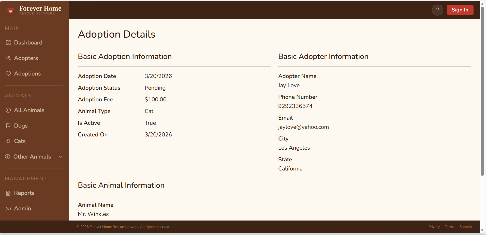
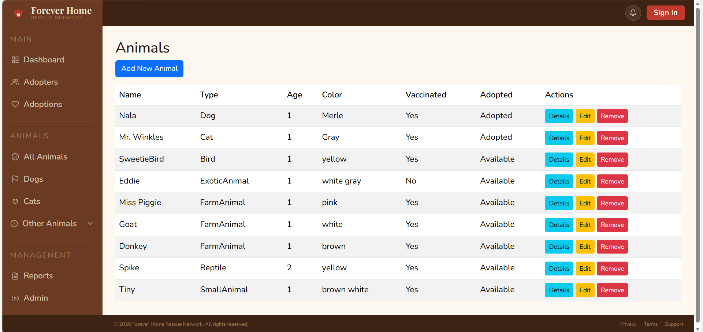
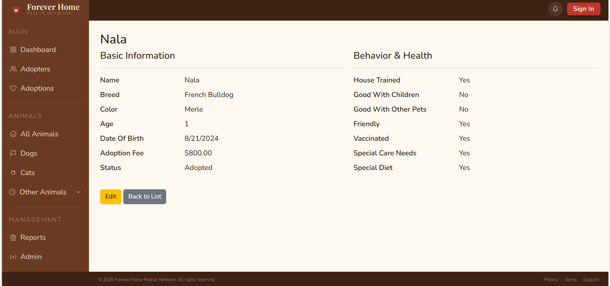
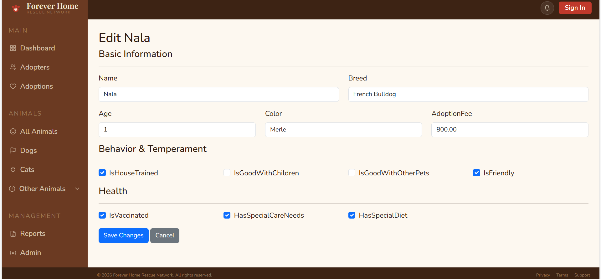

# Forever Home Rescue Network
### A Pet Adoption Management System built with ASP.NET Core MVC


---

## About This Project

Forever Home Rescue Network is a full-stack pet adoption management system built with ASP.NET Core MVC. It is designed to manage the complete lifecycle of a pet adoption, from animal intake and adopter registration through to adoption processing, payments, and post-adoption notes and warnings.

This project is being built as a portfolio piece while learning ASP.NET Core MVC, Entity Framework Core, and SQL Server. It is intentionally scoped to grow over time as new skills are learned, including Identity/authentication, JavaScript, and React.

---
## Screenshots

### Adoption Details


### Animal List


### Animal Details


### AnimalEdit


---

## Tech Stack

| Layer | Technology |
|---|---|
| Framework | ASP.NET Core MVC (.NET 8) |
| ORM | Entity Framework Core |
| Database | SQL Server |
| Frontend | Razor Views, Bootstrap 5 |
| Architecture | MVC with Service Layer and Repository Pattern |
| Version Control | Git / GitHub |

---

## Architecture

The project follows a clean layered architecture:

- **Models** — Pure data classes representing database entities
- **ViewModels** — Shaped data objects for passing between controllers and views
- **Contracts** — Interface definitions (read/write split per service)
- **Services** — Business logic and database operations
- **Controllers** — HTTP request handling and orchestration
- **Views** — Razor pages for the user interface

Services are split into query (read) and command (write) interfaces, keeping responsibilities clean and making the codebase easier to maintain and test.

---

## Features

### Animals
- Full animal management with inheritance-based type system
- Supported types: Dogs, Cats, Birds, Fish, Reptiles, Small Animals, Farm Animals, Exotic Animals
- Each animal type has type-specific attributes (breed for dogs/cats, species for reptiles etc.)
- Active/inactive status with soft delete pattern
- Adoption status tracking (IsAdopted flag)

### Adopters
- Full adopter registration and management
- Search and filter by name, phone, email, city, state
- Household information tracking (children, other pets)
- Adoption history per adopter

### Adoptions
- Complete adoption workflow from creation to completion
- Multi-step adoption creation with adopter and animal selection
- Automatic adoption fee population from animal record
- Adoption status management (Pending, Approved, Returned etc.)
- Automatic animal status update on adoption and return
- Return count tracking per animal and adopter
- Advanced search and filtering
- Soft deactivation preserving historical records

### Dashboard & Layout
- Professional responsive dashboard layout
- Custom branding — Forever Home Rescue Network
- Collapsible sidebar navigation with mobile hamburger menu
- Flyout submenu for animal type navigation
- Role-based navigation ready (pending Identity implementation)

---

## Project Structure

```
PetAdoptionMVC/
├── Contracts/              # Interface definitions
│   ├── IAnimalService.cs
│   ├── IAdopterService.cs
│   ├── IAdoptionService.cs
│   └── ...
├── Controllers/            # HTTP request handling
│   ├── AnimalController.cs
│   ├── AdopterController.cs
│   ├── AdoptionController.cs
│   └── ...
├── Data/                   # DbContext and database configuration
├── Models/                 # Data classes
│   ├── Animal.cs
│   ├── Adopter.cs
│   ├── Adoption.cs
│   └── Enums/
├── Services/               # Business logic
│   ├── AnimalService.cs
│   ├── AdopterService.cs
│   ├── AdoptionService.cs
│   └── ...
├── ViewModels/             # View data objects
│   ├── AdoptionCreateViewModel.cs
│   ├── AdoptionEditViewModel.cs
│   └── ...
├── Views/                  # Razor pages
│   ├── Adoption/
│   ├── Adopter/
│   ├── Animal/
│   └── Shared/
├── SearchFilters/
│   ├── AdopterSearchFilter/
│   ├── AdoptionSearchFilter/
│   ├── AnimalSearchFilter/
│   └── ...
└── wwwroot/                # Static assets
    └── css/
        └── forever-home.css
```

---

## Current Development Status

### Completed
- [x] Animal module (all types with inheritance)
- [x] Adopter module (full CRUD with search and filtering)
- [x] Adoption module (full CRUD with business logic)
- [x] Professional responsive dashboard layout
- [x] Custom CSS design system (Forever Home brand)
- [x] Mobile responsive sidebar with hamburger menu
- [x] Flyout submenu navigation

### In Progress
- [ ] Payment module
- [ ] Notes module
- [ ] Warnings module

---

## Roadmap

### Phase 2 — Core Business Logic (Next)
- Payment processing module
- Notes system (per adoption and per animal)
- Warnings system (adopter flags, animal flags, compatibility checks)

### Phase 3 — Authentication and Authorization
- ASP.NET Core Identity implementation
- Role based access control
  - Owner — full system access
  - Manager — location management, reports, staff scheduling
  - Staff — adoption processing, animal management
  - Volunteer — schedule viewing, task management
- CreatedBy / UpdatedBy fields wired to logged in user
- Role based navigation (show/hide based on user role)

### Phase 4 — JavaScript Enhancements
- Adoption Create: AnimalType dropdown filters Animal dropdown dynamically
- Adoption Create: Adoption fee auto-populates when animal is selected
- Adoption Create: Replace dropdowns with inline search modal for adopter and animal selection
- Dynamic search across all modules

### Phase 5 — Expanded Features
- Multiple location support
  - Animals assigned to locations
  - Staff assigned to locations
  - Managers oversee specific locations
- Volunteer portal
  - Schedule viewing and management
  - Task assignments
  - Messaging system
- Manager features
  - Staff scheduling
  - Location reports
  - Performance metrics
- Reporting and analytics dashboard

### Phase 6 — Public Facing Website
- Separate public website pulling available animals
- Location based animal browsing
- Online adoption inquiry submission
- React frontend (planned)

---

## Known Limitations

### Pending JavaScript Implementation
- Adoption Create: Animal dropdown does not filter by selected AnimalType. Planned for JavaScript phase.
- Adoption Create: Adoption fee does not auto-populate when animal is selected from dropdown. Planned for JavaScript AJAX implementation.
- Adoption Create/Edit: Dropdown selection will be replaced with inline search modal once JavaScript is learned.

### Pending Identity Implementation
- CreatedBy and UpdatedBy fields currently default to "System" placeholder
- All navigation is currently visible regardless of role
- No authentication on any routes

---

## Getting Started

### Prerequisites
- .NET 8 SDK
- SQL Server (LocalDB or full instance)
- Visual Studio 2022 or VS Code

### Setup
1. Clone the repository
```bash
git clone https://github.com/TanyaDThomas/PetAdoptionMVC.git
```

2. Update the connection string in `appsettings.json`
```json
"ConnectionStrings": {
  "DefaultConnection": "your-connection-string-here"
}
```

3. Run migrations
```bash
dotnet ef database update
```

4. Run the project
```bash
dotnet run
```

---

## Learning Notes

This project is being built while learning ASP.NET Core MVC. Some architectural decisions reflect the learning process and will be improved over time. Areas planned for refactoring include:

- Adding Animal navigation property to Adoption model to simplify queries
- Implementing proper unit tests once testing patterns are learned
- Adding FluentValidation for model validation
- Implementing proper error handling and logging

---

## Author

**Tanya Thomas**
- GitHub: [@TanyaDThomas](https://github.com/TanyaDThomas)

---

*This project is part of a portfolio being built while learning full-stack .NET development. It is actively developed and expanded as new skills are acquired.*
